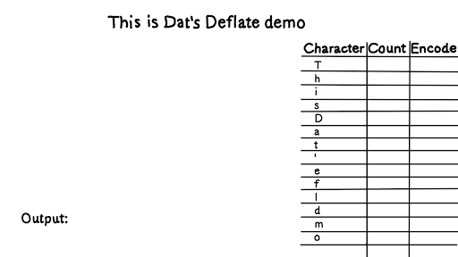

# File Compression
Set of file compression algorithms.

## Algorithms
1. [Huffman Compression Algorithm](#huffman-compression-algorithm)
2. [Lempel-Ziv-Welch Compression Algorithm](#lempel-ziv-welch-compression-algorithm)

---

## Huffman Compression Algorithm
This is algorithm is based uppon having the most common bytes in a file being represented using less than 8 bits. In this case, this is achieved using a binary tree that has to be written to the compressed file. Check out a visual representation of the algorithm below:

For more information you can access: [https://www.geeksforgeeks.org/huffman-coding-greedy-algo-3/](https://www.geeksforgeeks.org/huffman-coding-greedy-algo-3/).

#### Run
```sh
cd huffman
./compile #compile
./huffman compress file #run compress
./huffman decompress compressedFile #run decompress
```

#### Example
You can find some examples in the ```examples``` directory:
- Book (```examples/book```)

	The ```ls -l``` commands shows as follows:
	```
	-rw-r--r-- your_user_name your_group 25.6KB Jun 25 22:44 compressed.huff
	-rw-r--r-- your_user_name your_group 46.3KB Jun 25 22:44 original_file.txt
	```
	This represents a **44.7% percent compression rate**.

---

## Lempel-Ziv-Welch-Compression-Algorithm
This algorithm is based a group of bits that can store more than one or more bytes. An entry table is generated with the bytes that have already been read so when the same sequence is read again it will be substituted to the associated code in the entry table. A really important thing is that the entry table doesn't have to be written in the compressed file since it can be generated again by the decompressor.

For more info you can access: [https://www.geeksforgeeks.org/lzw-lempel-ziv-welch-compression-technique/](https://www.geeksforgeeks.org/lzw-lempel-ziv-welch-compression-technique/) .

#### Run
```sh
cd lzw
make
./lzw compress file #run compress
./lzw decompress compressedFile #run decompress
```

#### Example
You can find some examples in the ```examples``` directory:
- Book (```examples/book```)

	The ```ls -l``` commands shows as follows:
	```
	-rw-r--r-- your_user_name your_group 24.7KB Jun 25 22:44 compressed_lzw
	-rw-r--r-- your_user_name your_group 46.3KB Jun 25 22:44 original_file.txt
	```
	This represents a **46.7% percent compression rate**.

#### Implementation Limitations
- Size
  
  Since in this implementation the number of bits per code is fixed in 16 bits, the maximum number of elements in the entry table is 32767. Therefore, the algorithm may not work with files that are larger than 50kB (this will depend on the number of elements in the dictionary). However, the LZW algorithm can be implemented to support a larger range of files (from the smallest to the largest ones).

- Extension
  
  In this implementation, the compressed file doesn't contain the extension of the original file. However, this can be achieved rather easily by adding the extension string as the first bytes of the file.

